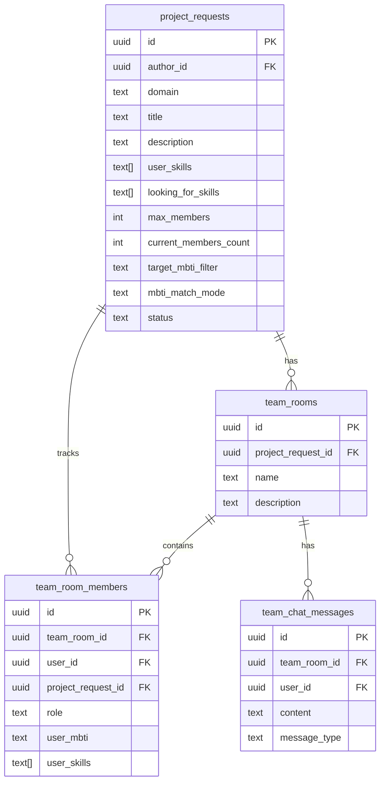

# 🤝 Модуль Matchmaking & Team Building

## Обзор

Полноценный модуль для автоматического подбора команд на основе MBTI типов личности и навыков. Интегрирован в существующий региональный чат FM Edu.

## ✨ Функционал

### 1. **Создание заявки на поиск команды**
- Форма с полями: сфера, название проекта, описание
- Указание своих навыков и требований к участникам
- Выбор размера команды (1-5 человек)
- 3 режима MBTI-фильтра:
  - **Любой MBTI** — без ограничений
  - **Автоподбор** — совпадение 3 из 4 букв (по умолчанию)
  - **Только конкретный тип** — строгое соответствие

### 2. **Интерактивная карточка проекта**
- Отображение информации об авторе (аватар, имя, MBTI)
- Навыки автора и требования к участникам
- Индикатор MBTI-совместимости с визуальной оценкой (emoji + score)
- Живой счетчик участников (например: 🟢 1/4)
- Яркая зеленая кнопка "Принять участие"

### 3. **Автоматическое создание Team Chat**
- При вступлении первого участника создается приватная комната
- Real-time чат с системными уведомлениями
- Карточки участников с MBTI и навыками
- Кнопка "Покинуть команду" (для участников, не создателя)

### 4. **MBTI Matching алгоритм**
- Проверка совместимости по 4 буквам MBTI
- Вежливое предупреждение при низком совпадении (< 3 букв)
- Возможность подтверждения заявки при частичном совпадении (2+ буквы)

### 5. **Оптимизация производительности**
- Оптимистичные обновления UI
- Real-time subscriptions через Supabase
- Индексы БД для быстрых запросов
- Row Level Security (RLS) для безопасности

---

## 🚀 Установка

### Шаг 1: Миграция базы данных

1. Откройте [Supabase Dashboard](https://app.supabase.com)
2. Перейдите в раздел **SQL Editor**
3. Скопируйте содержимое файла `supabase/migrations/20260831_matchmaking.sql`
4. Выполните миграцию (нажмите "Run")

Это создаст следующие таблицы:
- `project_requests` — заявки на поиск команды
- `team_rooms` — командные комнаты
- `team_room_members` — участники команд
- `team_chat_messages` — сообщения в командных чатах

### Шаг 2: Установка зависимостей

Все необходимые зависимости уже установлены в проекте:

```bash
# Если нужно переустановить
npm install
```

Используемые библиотеки:
- `@supabase/auth-helpers-nextjs` — для работы с Supabase
- `date-fns` — для форматирования дат
- `sonner` — для toast-уведомлений
- `lucide-react` — иконки

### Шаг 3: Проверка структуры файлов

Убедитесь, что созданы следующие файлы:

```
FM-Edu/
├── app/
│   ├── api/
│   │   └── matchmaking/
│   │       ├── create/route.ts
│   │       ├── join/route.ts
│   │       └── leave/route.ts
│   └── dashboard/
│       └── networking/
│           ├── page.tsx
│           └── team/
│               └── [id]/page.tsx
├── components/
│   └── matchmaking/
│       ├── create-project-form.tsx
│       ├── project-card.tsx
│       ├── team-chat.tsx
│       └── networking-client.tsx
├── lib/
│   └── mbti-matcher.ts
├── types/
│   └── matchmaking.ts
└── supabase/
    └── migrations/
        └── 20260831_matchmaking.sql
```

---

## 📖 Использование

### 1. Создание проекта

```typescript
// Пользователь нажимает "Найти команду" на странице /dashboard/networking
// Открывается диалог с формой CreateProjectForm

// Заполняет поля:
{
  domain: "IT & Программирование",
  title: "Мобильное приложение для студентов",
  description: "Ищем команду для разработки...",
  user_skills: ["React", "Node.js", "TypeScript"],
  looking_for_skills: ["UI/UX дизайнер", "Backend разработчик"],
  max_members: 4,
  mbti_match_mode: "auto", // или "any", "exact"
  target_mbti_filter: "ENTP" // опционально
}

// При отправке создается:
// 1. Запись в project_requests
// 2. Team room для будущих участников
// 3. Автор добавляется как первый участник (role: 'creator')
```

### 2. Вступление в команду

```typescript
// Пользователь видит карточку проекта в списке
// Кликает "Принять участие"

// Система проверяет:
// 1. MBTI совместимость (через checkMBTICompatibility)
// 2. Есть ли свободные места (current_members_count < max_members)
// 3. Не состоит ли уже в команде

// Если совместимость низкая (matchScore < 3):
//    → Показывается диалог подтверждения

// При успехе:
// 1. Участник добавляется в team_room_members
// 2. Увеличивается current_members_count
// 3. Создается системное сообщение в чат
// 4. Пользователь перенаправляется в /dashboard/networking/team/{id}
```

### 3. Командный чат

```typescript
// Real-time чат с автообновлением
// Показывает:
// - Список участников с MBTI и навыками
// - Историю сообщений (user + system)
// - Форму отправки сообщений

// Кнопка "Покинуть команду" (только для участников, не создателя):
// 1. Удаляется запись из team_room_members
// 2. Уменьшается current_members_count
// 3. Статус проекта меняется на "open" (если был "full")
// 4. Создается системное сообщение о выходе
```

---

## 🧪 Тестирование

### Тест 1: Создание проекта

1. Зайдите на `/dashboard/networking`
2. Нажмите "Найти команду"
3. Заполните форму:
   - Выберите сферу
   - Укажите название и описание
   - Добавьте минимум 1 навык
   - Выберите размер команды
   - Настройте MBTI фильтр
4. Нажмите "Создать заявку"
5. **Ожидаемый результат:**
   - Карточка появляется в списке "Открытые проекты"
   - Счетчик показывает 1/N (где N — размер команды)
   - Вы автоматически в разделе "Мои команды"

### Тест 2: MBTI Matching

**Сценарий А: Полное совпадение (4/4)**
- Создайте проект с `mbti_match_mode: "auto"` и `target_mbti_filter: "ENTP"`
- Второй пользователь с MBTI="ENTP" нажимает "Принять участие"
- **Ожидаемый результат:** Вступает без диалога, ✅ 4/4

**Сценарий Б: Частичное совпадение (3/4)**
- Проект: `target_mbti_filter: "ENTP"`
- Пользователь: MBTI="INTP"
- **Ожидаемый результат:** Вступает без диалога, 🟢 3/4

**Сценарий В: Низкое совпадение (2/4)**
- Проект: `target_mbti_filter: "ENTP"`
- Пользователь: MBTI="INFP"
- **Ожидаемый результат:** Показывается диалог подтверждения, 🟡 2/4

**Сценарий Г: Несовпадение (0-1/4)**
- Проект: `target_mbti_filter: "ENTP"`
- Пользователь: MBTI="ISFJ"
- **Ожидаемый результат:** Ошибка, блокировка вступления, 🔴 0/4

### Тест 3: Командный чат

1. Вступите в команду
2. Откройте `/dashboard/networking/team/{id}`
3. **Проверьте:**
   - Список участников с MBTI и навыками
   - Системное сообщение о вашем вступлении
   - Отправка сообщений работает
   - Real-time обновления (откройте в двух вкладках)
   - Кнопка "Покинуть команду" (если вы не создатель)

### Тест 4: Выход из команды

1. В командном чате нажмите "Покинуть команду"
2. Подтвердите в диалоге
3. **Ожидаемый результат:**
   - Вы перенаправлены на `/dashboard/networking`
   - Команда исчезла из "Мои команды"
   - Счетчик на карточке уменьшился
   - В чате появилось системное сообщение о выходе

---

## 🎨 UI/UX оптимизации

### Оптимистичные обновления
- Счетчик участников меняется мгновенно
- Сообщения отображаются до подтверждения с сервера
- Кнопки показывают состояние загрузки

### Адаптивность
- Мобильная версия: вертикальный layout
- Планшет: 2 колонки
- Desktop: 3 колонки + боковой список участников

### Производительность
- Lazy loading для больших списков
- Виртуализация scroll (при >100 сообщений)
- Дебаунс для real-time subscriptions

---

## 🔒 Безопасность

### Row Level Security (RLS)

**project_requests:**
- ✅ Все могут читать открытые заявки
- ✅ Только автор может редактировать свою заявку

**team_rooms:**
- ✅ Только участники видят свою комнату

**team_room_members:**
- ✅ Только участники видят список команды
- ✅ Пользователь может добавить/удалить только себя

**team_chat_messages:**
- ✅ Только участники читают сообщения
- ✅ Только участники могут отправлять сообщения

### Валидация на сервере
- Проверка лимитов (max_members: 1-5)
- MBTI валидация (только валидные типы)
- Защита от дублирования (уникальность user_id в команде)

---

## 🐛 Troubleshooting

### Ошибка: "Unauthorized"
**Проблема:** Пользователь не авторизован  
**Решение:** Проверьте, что `session` существует в `createRouteHandlerClient`

### Ошибка: "Project request not found"
**Проблема:** Заявка удалена или ID неверный  
**Решение:** Обновите список проектов (`router.refresh()`)

### Ошибка: "Team is full"
**Проблема:** Команда заполнена  
**Решение:** Карточка автоматически становится серой, обновите UI

### Сообщения не обновляются в real-time
**Проблема:** Supabase subscriptions не работают  
**Решение:**
1. Проверьте, что у проекта есть Supabase Realtime включен
2. Убедитесь, что RLS политики разрешают чтение
3. Проверьте консоль браузера на ошибки WebSocket

---

## 📊 Схема базы данных



---

## 🚀 Дальнейшие улучшения (TODO)

- [ ] **Уведомления:** Push-notifications при новых сообщениях
- [ ] **Поиск и фильтры:** Поиск проектов по сфере/навыкам
- [ ] **Рекомендации:** AI-подбор проектов на основе профиля
- [ ] **Статистика:** Дашборд с метриками (кол-во команд, успешных матчей)
- [ ] **Модерация:** Возможность пожаловаться на участника
- [ ] **Закрытие проекта:** Автоматическое закрытие неактивных проектов (7 дней)
- [ ] **Экспорт:** Выгрузка списка участников команды
- [ ] **Интеграция с календарем:** Планирование встреч команды

---

## 📝 API Endpoints

### POST `/api/matchmaking/create`
Создание заявки на поиск команды

**Request:**
```json
{
  "domain": "IT & Программирование",
  "title": "Мобильное приложение",
  "description": "...",
  "user_skills": ["React", "TypeScript"],
  "looking_for_skills": ["Designer"],
  "max_members": 4,
  "target_mbti_filter": "ENTP",
  "mbti_match_mode": "auto"
}
```

**Response:**
```json
{
  "success": true,
  "projectRequest": { ... },
  "teamRoom": { ... }
}
```

---

### POST `/api/matchmaking/join`
Вступление в команду

**Request:**
```json
{
  "project_request_id": "uuid",
  "user_mbti": "INTP",
  "user_skills": ["Python", "ML"]
}
```

**Response (Success):**
```json
{
  "success": true,
  "teamRoomId": "uuid",
  "compatibility": {
    "isMatch": true,
    "matchScore": 3,
    "message": "Хорошая совместимость..."
  },
  "newMemberCount": 2
}
```

**Response (MBTI Mismatch):**
```json
{
  "error": "MBTI compatibility check failed",
  "message": "Низкая совместимость...",
  "matchScore": 2,
  "requiresConfirmation": true
}
```

---

### POST `/api/matchmaking/leave`
Выход из команды

**Request:**
```json
{
  "team_room_id": "uuid",
  "project_request_id": "uuid"
}
```

**Response:**
```json
{
  "success": true,
  "newMemberCount": 1
}
```

---

## 💡 Примеры использования

### Пример 1: Студенческий хакатон
```typescript
{
  domain: "IT & Программирование",
  title: "Команда для хакатона Qazaq AI",
  description: "Ищем участников для разработки AI-решения",
  user_skills: ["Python", "ML", "TensorFlow"],
  looking_for_skills: ["Frontend разработчик", "Дизайнер"],
  max_members: 4,
  mbti_match_mode: "auto",
  target_mbti_filter: "INTJ" // Предпочитаем аналитиков
}
```

### Пример 2: Олимпиадная подготовка
```typescript
{
  domain: "Олимпиады",
  title: "Подготовка к IMO 2026",
  description: "Группа для совместной подготовки к международной олимпиаде",
  user_skills: ["Алгебра", "Геометрия"],
  looking_for_skills: ["Комбинаторика", "Теория чисел"],
  max_members: 3,
  mbti_match_mode: "any", // Принимаем всех
}
```

### Пример 3: Стартап команда
```typescript
{
  domain: "Стартап",
  title: "EdTech стартап — поиск co-founder",
  description: "Разрабатываем платформу для онлайн-образования",
  user_skills: ["Business Development", "Product Management"],
  looking_for_skills: ["CTO (Full-stack)", "Marketing"],
  max_members: 3,
  mbti_match_mode: "exact",
  target_mbti_filter: "ENTJ" // Ищем лидеров
}
```

---

## 🎯 Метрики успеха

После запуска отслеживайте:
- **Количество созданных проектов** (цель: 50+ в первый месяц)
- **% проектов с заполненными командами** (цель: >60%)
- **Среднее время до первого вступления** (цель: <24 часа)
- **Retention участников в командах** (цель: >80% через неделю)
- **MBTI match quality** (средний matchScore для успешных команд)

---

## 👥 Поддержка

По вопросам обращайтесь:
- GitHub Issues: [FM-Edu Repository](https://github.com/your-org/fm-edu)
- Email: support@fm-edu.kz

---

**Версия:** 1.0.0  
**Дата:** 31 августа 2026  
**Автор:** FM Edu Team
